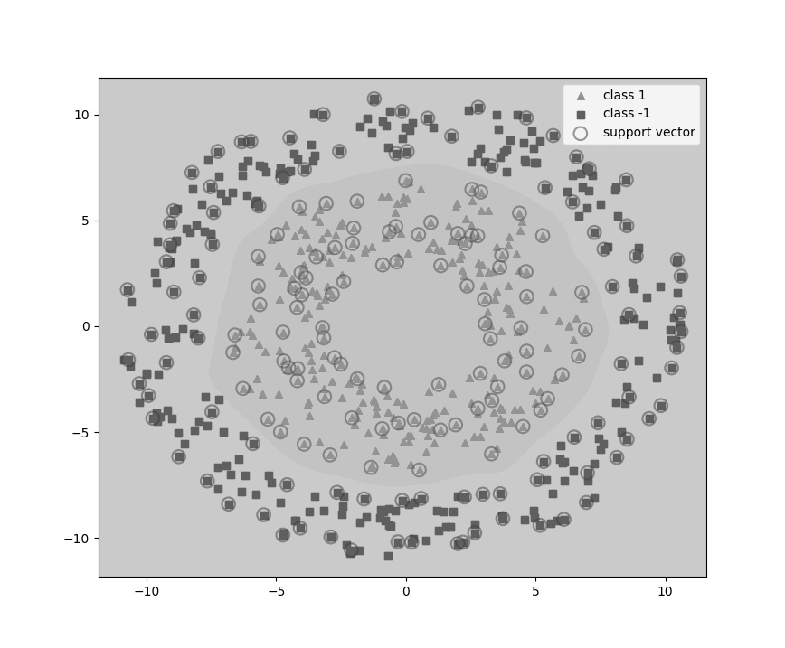

# 图片编码与解码
### Huffman编码
哈夫曼编码(Huffman Coding)，又称霍夫曼编码，是一种编码方式，可变字长编码(VLC)的一种。
Huffman于1952年提出一种编码方法，该方法完全依据字符出现概率来构造异字头的平均长度最短的码字，有时称之为最佳编码，
一般就叫做Huffman编码（有时也称为霍夫曼编码）。

### 代码原理（代码有详细注释，详情查看my_huffman.py）

#### 编码
1. OpenCV读取一张图片，统计每个像素出现的次数
2. 统计每个像素出现的次数，按从大到小的顺序排列生成节点列表
3. 每次都将频数最小的两个节点作为新节点（二叉树）的左右节点，新节点的频数为左右节点频数之和
4. 从节点列表中删除最小的两个节点，把新节点加入节点列表
5. 重复3和4直到只剩下一个节点
6. 按huffman编码表对图像进行编码

#### 解码
1. 读取保存有huffman树的二进制文件
2. 从根节点开始向下搜索，0为左节点， 1为右节点，直到遇到叶子节点
3. 从叶子节点返回根节点，记录编码顺序
4. 重复1和2直到遍历完所有叶子节点
5. 按huffman编码表对图像进行解码

### 运行要求
- CPU AMD Ryzen R5-2600 @3.4Ghz
- 内存 16g
- win10家庭版 64位
- python >= 3.8.5
- pycharm 2020.1

### 使用说明
运行my_huffman.exe，等待大约5s，程序开始运行，弹出图片选择对话框，选择任意.png类型（或其它格式）
的文件，由于opencv读取文件不支持中文路径，所以路径中如果有中文会提示重新选择图片。

### 输入图像

### 输出图像

### 输出
#### 所有像素的编码
#### 示例
- 77.0 00000
- 101.0 000010
- 130.0 0000110
- 190.0 00001110
- 194.0 00001111

#### 输出指标
- 压缩前图片大小：129.38Kb
- 压缩后图片大小：98.52Kb
- 压缩率：76.15%
- PSNR：100.00%
- 压缩与解压总用时：0.7s
#### 输出文件
- 压缩后的图片保存到compressed_image.jpg 
- Huffman Tree 对象以二进制形式保存在encode.bin

#### 作者
ZTF tju 